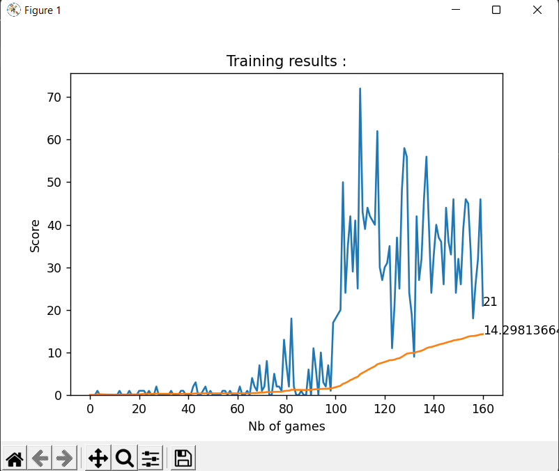
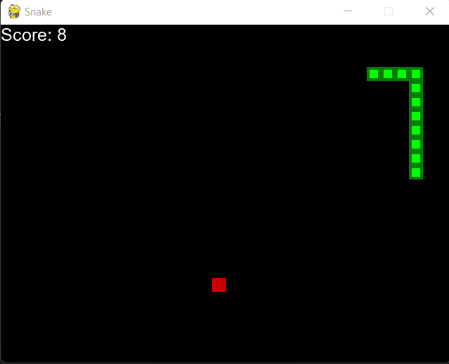

# AI Snake 🐍

Teaching an AI model to play snake with Reinforcement Learning and Q learning using PyTorch and Pygame.

Training results           |  Snake game
:-------------------------:|:-------------------------:
  |  
